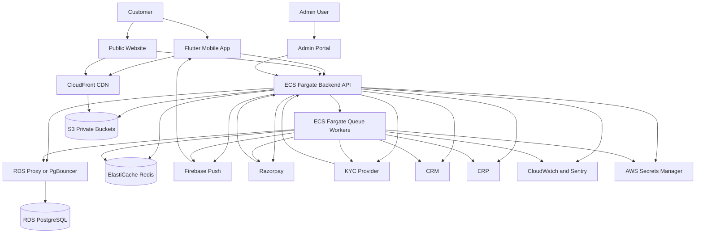

# 16 - System Overview
## Moozhayil Gold & Diamonds - Complete Platform Explanation

This document explains the whole Moozhayil platform as a production system. It is documentation only. It does not define production code.

If this document conflicts with earlier source material, the final authority order is:
- `14-final-architecture.md` for architecture lock decisions.
- `17-database-bible.md` for database decisions.
- `18-api-contract.md` for API decisions.
- `19-operational-playbook.md` for operational decisions.
- `20-engineering-principles.md` for engineering process decisions.
- `16-system-overview.md` for whole-system explanation and cross-system flow.

Why: Each final document owns a different decision surface. The system overview explains the platform, but it must not override the subject-specific final authorities.

---

## 1. Overall Architecture

Moozhayil is a premium gold ownership platform made of mobile, web, backend, database, storage, queues, observability, admin, and third-party integrations.

### 1.1 Mobile App

The mobile app is the primary customer product.

Responsibilities:
- Onboarding, OTP auth, KYC journey, Home, Shop, Dream Vault, Goals, My Gold, Aura, Profile, Cart, Orders, Notifications, Store Locator, Referrals.
- Offline read-only presentation of cached Home, Dream Vault, Goals, and My Gold data.
- Secure token storage using `flutter_secure_storage`.
- Non-sensitive cache using Hive.
- API communication through Dio with auth, refresh, retry, and request ID propagation.
- State management through Riverpod generated providers.
- Navigation through GoRouter route constants.

Why Flutter: One premium mobile experience can be built for iOS and Android with a single codebase, while still allowing custom motion and polished UI.

### 1.2 Website

The website is a public marketing and catalog companion, not the primary transactional app in v1.

Responsibilities:
- Brand storytelling.
- Public catalog browsing.
- SEO pages for collections, occasions, stores, and trust anchors.
- Referral landing pages.
- Deep links into the app.

Why separate web: SEO and public acquisition have different performance, routing, and deployment needs than the Flutter app.

### 1.3 Backend

The backend is a Node.js 20 TypeScript Express modular monolith.

Responsibilities:
- REST API.
- Auth and sessions.
- KYC orchestration.
- Catalog and pricing.
- Dream Vault.
- Cart and checkout.
- Goals and contributions.
- Gold ledger and balance.
- Orders, payments, refunds, and reconciliation.
- Aura context building and response filtering.
- Notifications.
- Admin and CMS APIs.
- Webhooks.
- Analytics events.

Why modular monolith: It is simpler to operate than microservices while still enforcing clear domain boundaries. The platform can scale to millions of users through stateless API tasks, database pooling, caching, queues, partitioning, and read optimization before service extraction is needed.

### 1.4 Database

PostgreSQL 15 on AWS RDS is the source of truth.

Responsibilities:
- Customer identity.
- KYC state.
- Product catalog.
- Gold rates.
- Goals.
- Contributions.
- Append-only gold ledger.
- Orders.
- Payments.
- Inventory reservations.
- Notifications.
- Audit logs.
- Webhook events.
- Admin records.

Why PostgreSQL: The platform needs transactional consistency, relational integrity, JSON snapshots, indexes, partitioning, and auditable financial state.

### 1.5 Redis

Redis is used through AWS ElastiCache.

Responsibilities:
- BullMQ queue backing.
- Short-lived cache.
- Rate limit counters.
- Idempotency acceleration where safe.

Redis is never source of truth.

Why: Redis improves latency and queue throughput, but all correctness must survive Redis failure through PostgreSQL and third-party reconciliation.

### 1.6 S3

S3 stores all uploaded media and private documents.

Buckets:
- Public-origin media bucket for product and CMS image originals, private with CloudFront access only.
- Private KYC bucket for selfies and document artifacts.
- Admin upload staging prefix.

Why S3: Durable, scalable object storage with lifecycle policies and CloudFront integration.

### 1.7 CloudFront

CloudFront is the only public delivery path for images and static media.

Responsibilities:
- CDN for product images, CMS banners, collection images, store assets, and AR files.
- Cache invalidation for replaced media.
- Mobile-optimized image derivatives.

Why: Premium performance depends on fast images. Direct S3 public access is forbidden.

### 1.8 Firebase

Firebase Admin SDK sends push notifications.

Responsibilities:
- Contribution success and failure pushes.
- KYC result pushes.
- Order status pushes.
- Milestone pushes.
- Gold rate alerts.
- Aura suggestion pushes.

Why Firebase: It is the standard cross-platform push path for iOS and Android through FCM/APNs integration.

### 1.9 Razorpay

Razorpay is the payment provider.

Responsibilities:
- UPI payments.
- Card payments.
- Netbanking.
- UPI autopay mandates.
- Refunds.
- Payment webhooks.

Why Razorpay: It supports Indian payment rails required for gold contributions, checkout, partial payments, and refunds.

### 1.10 KYC Provider

The KYC provider verifies Aadhaar OTP, PAN, and selfie checks.

Responsibilities:
- Aadhaar OTP initiation and verification.
- PAN verification.
- Selfie verification or liveness artifact processing.
- KYC webhooks.

Why external provider: Regulated identity verification requires provider integrations, audit trails, and security controls not appropriate to build internally first.

### 1.11 CRM Integration

CRM integration is the system of record for support-facing customer context.

Responsibilities:
- Customer profile summary.
- KYC support state.
- Order support state.
- Phone-number-change support case.
- High-value customer support flags.

Canonical implementation: backend emits support-safe customer events to CRM through the transactional outbox.

Why: Support teams need context without direct database access or PII overexposure.

### 1.12 ERP Integration

ERP integration connects online orders to store inventory and fulfillment.

Responsibilities:
- Product SKU sync.
- Stock sync.
- Order fulfillment handoff.
- Delivery status import.
- Manual inventory corrections.

Canonical implementation: backend owns customer-facing product state; ERP sync jobs import and reconcile stock and fulfillment events.

Why: ERP is operationally important but must not directly control customer transactions without validation.

### 1.13 Admin Portal

Admin portal is a web application for internal operators.

Responsibilities:
- Product CRUD.
- Image management.
- CMS.
- Gold rate override.
- KYC review.
- Order management.
- Refund workflows.
- SAR review.
- Audit log viewing.
- Manual ledger adjustment with maker-checker.

Why separate admin: Internal workflows require roles, audit, and operational views not suitable for the customer app.

### 1.14 CMS

CMS is backend-managed content for app and web surfaces.

Content:
- Home banners.
- Shop banners.
- Collection metadata.
- Occasion metadata.
- Store trust content.
- App copy blocks where approved.

Why backend CMS: Content must be dynamic without app releases, but controlled and auditable.

### 1.15 Analytics

Analytics are privacy-safe product and business events.

Responsibilities:
- Funnel measurement.
- KYC drop-off.
- Dream Vault saves.
- Goal creation conversion.
- Contribution success/failure.
- Checkout and redemption conversion.
- Aura usage and value.

Rules:
- No Aadhaar, PAN, phone, full address, raw Aura chat, payment token, or document values.
- Critical financial metrics are computed from PostgreSQL, not analytics events.

### 1.16 Monitoring

Monitoring uses CloudWatch metrics, Sentry, and dashboarded business metrics.

Monitored areas:
- API latency and error rate.
- Queue depth and dead letters.
- RDS connections and slow queries.
- Redis availability.
- Webhook failure rate.
- Payment reconciliation failures.
- KYC SLA.
- Stale gold rate.
- Push send failures.
- Aura cost and latency.

### 1.17 Logging

Backend logs are structured JSON through Winston and CloudWatch.

Rules:
- Every request has `request_id`.
- Logs include `user_id` only when authenticated and safe.
- PII is redacted.
- Payment provider IDs are logged only where operationally required.

### 1.18 Queue Workers

Queue workers are BullMQ processors.

Queues:
- `payments`
- `autopay`
- `notifications`
- `gold_rates`
- `kyc`
- `aura`
- `reconciliation`
- `cms`
- `analytics`
- `outbox`

Workers are idempotent and reload authoritative state from PostgreSQL.

### 1.19 Notification Service

The notification service creates in-app notifications and push jobs.

Responsibilities:
- Persist notification rows.
- Generate deep links.
- Queue Firebase push.
- Track sent/read status.

Push payloads are not authoritative state.

### 1.20 Aura Service

Aura is a trusted jewellery advisor service.

Responsibilities:
- Build redacted user context.
- Generate structured goal planning and discovery responses.
- Filter recommendations after model output.
- Cache home insights.
- Enforce quotas and safety rules.

Aura is not support, not ChatGPT, and not financial advice.

### 1.21 Search

Launch search uses PostgreSQL full-text search.

Responsibilities:
- Product search.
- Category search.
- Collection search.
- Occasion search.
- Autocomplete groups.

Why PostgreSQL full-text first: It avoids premature OpenSearch infrastructure. OpenSearch is introduced only after measured scale or ranking needs justify it.

### 1.22 Caching

Caching exists at three layers:
- Redis backend cache.
- CloudFront media cache.
- Hive mobile cache.

Rules:
- Transaction paths never trust cached price, stock, balance, KYC, or payment state.
- Mutable catalog cache is invalidated by events.
- Mobile cache is read-only offline.

### 1.23 Image Processing

Image processing generates mobile-friendly derivatives.

Derivatives:
- Thumbnail.
- Product grid.
- Product detail.
- Hero/banner.
- Web SEO image.

Why: Premium performance requires fast image loading and stable layout.

### 1.24 Background Jobs

Background jobs handle non-request work:
- Autopay contribution runs.
- Payment reconciliation.
- Refund reconciliation.
- Gold rate refresh.
- Stale gold rate alerts.
- KYC webhooks.
- Aura insight generation.
- Balance snapshots.
- Reservation expiry.
- Notification sending.
- CRM and ERP sync.
- Analytics event export.

### 1.25 Secrets

Secrets are stored in AWS Secrets Manager.

Secrets:
- Database URL.
- JWT keys.
- Razorpay keys.
- KYC provider keys.
- Firebase private key.
- AWS credentials where IAM role is not enough.
- Gold rate API keys.
- CRM/ERP credentials.

Secrets are not stored in repo or mobile app.

### 1.26 Infrastructure

Production infrastructure:
- ECS Fargate API service.
- ECS Fargate worker services.
- RDS PostgreSQL with PITR.
- RDS Proxy or PgBouncer.
- ElastiCache Redis.
- S3.
- CloudFront.
- Route 53.
- ACM TLS.
- Secrets Manager.
- CloudWatch.
- Sentry.

---

## 2. Repository Strategy

### 2.1 Canonical Repositories

The production platform uses separate repositories:

1. `moozhayil-mobile`
2. `moozhayil-backend`
3. `moozhayil-web`
4. `moozhayil-admin`

### 2.2 Why Separate Repositories

Decision: Use separate repositories instead of a monorepo.

Why:
- Mobile release cycles differ from backend releases.
- Web SEO deployment differs from app store deployment.
- Admin portal has different access controls and risk.
- Backend requires migration discipline and secrets access that mobile/web should not have.
- Senior teams can own each surface independently.

### 2.3 Repository Responsibilities

`moozhayil-mobile`:
- Flutter app.
- Mobile models generated or manually matched to API contract.
- Mobile routing, UI, caching, and notification handling.

`moozhayil-backend`:
- REST API.
- Prisma migrations.
- Workers.
- Admin APIs.
- Webhooks.
- Integration jobs.

`moozhayil-web`:
- Marketing website.
- Public catalog pages.
- SEO.
- Referral landing pages.
- Deep links into app.

`moozhayil-admin`:
- Internal operator portal.
- Product, KYC, order, CMS, rate, audit, refund, SAR workflows.

### 2.4 Communication Between Repositories

The backend publishes the API contract from `18-api-contract.md`.

Rules:
- Mobile, web, and admin consume only public/backend-approved APIs.
- Backend changes require contract test updates.
- Breaking API changes require `/v2`.
- Shared enum changes require coordinated PRs and release sequencing.
- No repository imports code from another repository.

Why: This keeps deployments independent while preserving deterministic contracts.

---

## 3. Data Flow

Each flow below describes the full lifecycle across user, Flutter, backend, Redis, database, queue, third party, response, failures, and retries.

### 3.1 Login

User: enters Indian phone number.

Flutter:
- Validates phone format.
- Calls `POST /auth/send-otp`.
- Shows OTP screen only after backend confirms dispatch.

Backend:
- Validates request with Zod.
- Rate-limits by phone and IP.
- Creates OTP session.
- Sends OTP through SMS provider.
- Stores hashed OTP and expiry.

Redis:
- Stores rate limit counters.
- May cache OTP attempt metadata, but database remains source if persisted.

Database:
- Stores OTP session if persistence is required for audit and multi-instance behavior.

Third party:
- SMS provider dispatches OTP.

Response:
- `otp_session_id`, expiry, resend timing.

Failure handling:
- Invalid phone returns `422`.
- Rate limit returns `429`.
- SMS dispatch failure returns explicit error.

Retry:
- User can resend after backend-provided delay.

### 3.2 OTP Verification

User: enters OTP.

Flutter:
- Auto-submits after 6 digits.
- Calls `POST /auth/verify-otp`.
- Stores tokens securely on success.

Backend:
- Validates session and OTP.
- Creates or loads user.
- Creates `auth_sessions` row.
- Returns access and refresh tokens.

Database:
- `users`
- `auth_sessions`
- `user_devices` after device registration.

Response:
- Access token, refresh token, expiry, user summary.

Failure:
- Wrong OTP, expired OTP, max attempts.

Retry:
- User retries until max attempts. After lockout, new OTP session is required.

### 3.3 Token Refresh

Flutter:
- Dio interceptor receives `401`.
- Calls `POST /auth/refresh`.
- Retries original request once.

Backend:
- Verifies refresh token hash in `auth_sessions`.
- Checks revoked/expired state.
- Issues new access token.

Failure:
- Invalid refresh redirects to auth.
- Multi-step draft state is preserved locally.

### 3.4 Browsing Products

User: opens Shop/Home collection.

Flutter:
- Reads cached list if available.
- Calls `GET /products`.
- Renders shimmer then product cards.

Backend:
- Validates filters.
- Reads current gold rate.
- Computes prices server-side.
- Applies personalization if optional auth exists.

Redis:
- Product listing cache by filter, cursor, auth personalization bit, and price version.

Database:
- `products`, `product_images`, `categories`, `collections`, `occasions`, `gold_rate_history`, `dream_vault_items`.

Response:
- Cursor-paginated product cards with `price_valid_until`.

Failure:
- Cache miss falls back to database.
- Database error returns standard error.

Retry:
- Flutter retry button or pull refresh.

### 3.5 Searching

User: types query.

Flutter:
- Debounces 300ms.
- Sanitizes display but backend performs authoritative validation.
- Calls `GET /products/search`.

Backend:
- Sanitizes search query.
- Uses PostgreSQL full-text search.
- Returns grouped categories, collections, and products.

Failure:
- Empty result returns structured no-results response.
- Invalid query returns `422`.

### 3.6 Adding to Dream Vault

User: taps Save to Dream Vault.

Flutter:
- If unauthenticated, stores product ID locally and opens auth.
- If authenticated, sends `POST /vault`.
- Optimistically updates only after request is accepted or uses pending state.

Backend:
- Validates product exists and is published.
- Inserts `dream_vault_items`.
- Returns item and goal suggestion.

Database:
- `dream_vault_items` with unique active `(user_id, product_id)`.

Queue:
- Optional analytics outbox event.

Failure:
- Duplicate returns `409`.
- Product missing returns `404`.

Retry:
- Network retry is safe because duplicate maps to already-in-vault state.

### 3.7 Creating Goal

User: completes goal creation flow.

Flutter:
- Requires KYC gate.
- Generates idempotency key.
- Calls `POST /goals`.
- Persists draft state until success.

Backend:
- Validates KYC tier.
- Validates active goal count.
- Validates monthly amount and duration.
- Refreshes current product price if target product exists.
- Creates goal, payment mandate setup intent, and outbox event in transaction where applicable.

Database:
- `goals`
- `payment_mandates`
- `idempotency_keys`
- `outbox_events`

Third party:
- Razorpay mandate setup where applicable.

Failure:
- KYC required, goal limit, payment setup failure, price changed.

Retry:
- Same idempotency key returns same result.

### 3.8 Monthly Contribution

Queue:
- Autopay job runs on due date.

Backend worker:
- Loads due contribution or creates scheduled contribution.
- Locks contribution row.
- Creates Razorpay payment/mandate charge.
- Records `payment_transactions`.

Razorpay:
- Processes mandate debit.

Webhook:
- Confirms success or failure.

Database:
- `contributions`
- `payment_transactions`
- `gold_ledger_entries`
- `gold_balance_snapshots`
- `outbox_events`

Failure:
- Payment failure marks contribution `payment_failed`.
- Goal becomes `contribution_due` after grace period.

Retry:
- Reconciliation job checks pending transactions older than 10 minutes.

### 3.9 Payment Success

Third party:
- Razorpay sends webhook.

Backend:
- Verifies signature.
- Stores `webhook_events`.
- Enqueues processing job.

Worker:
- Reloads payment transaction.
- Applies monotonic state transition.
- Completes contribution or order.
- Posts ledger entry if contribution or redemption is involved.
- Writes outbox events.

Response:
- Webhook receives `200` after durable persistence.

Failure:
- Duplicate webhook ignored.
- Out-of-order webhook stored and reconciled.

### 3.10 Ledger Update

Backend:
- Posts append-only ledger entry in transaction.
- Updates balance snapshot or schedules snapshot refresh.
- Writes outbox event.

Database:
- `gold_ledger_entries`
- `gold_balance_snapshots`

Failure:
- Constraint violation rolls back whole transaction.

Retry:
- Idempotency key prevents duplicate ledger entry.

### 3.11 Gold Balance Update

Flutter:
- Invalidates gold balance providers after contribution, redemption, refund, or app resume.

Backend:
- Serves `GET /gold-balance` from snapshot if fresh.
- Recomputes from ledger if stale.

Redis:
- Short-lived balance response cache may exist but is invalidated after ledger events.

### 3.12 Order Creation

User: taps Buy Now or confirms checkout.

Flutter:
- Refreshes price if expired.
- Generates idempotency key.
- Calls `POST /orders`.

Backend:
- Validates auth, KYC threshold, address, price, stock.
- Creates inventory reservation.
- Creates order.
- Initiates payment if needed.

Database:
- `inventory_reservations`
- `orders`
- `order_items`
- `payment_transactions`
- `idempotency_keys`

Failure:
- Out of stock, unserviceable pincode, price changed, insufficient balance, KYC required.

Retry:
- Same idempotency key returns existing order or payment state.

### 3.13 Inventory Reservation

Backend:
- Creates reservation atomically if available stock minus active reservations is positive.
- Reservation expires if payment does not complete in time.

Queue:
- Reservation expiry job releases expired reservations.

Admin:
- Stock edits account for active reservations.

### 3.14 Redemption

User: confirms Buy With My Gold.

Flutter:
- Calls `POST /orders` with `payment_method = gold_balance`.

Backend:
- Validates KYC.
- Validates current balance from ledger.
- Validates current price and reservation.
- Creates `redemption_debit` ledger entry and order in one transaction.

Failure:
- Insufficient balance due to rate change returns updated difference.
- Product out of stock returns `OUT_OF_STOCK`.

Retry:
- Idempotency prevents duplicate debit.

### 3.15 Notifications

Backend:
- Domain event writes outbox row.

Worker:
- Creates `notifications`.
- Sends push through Firebase if device token exists and user preferences allow.

Flutter:
- Receives push.
- Opens deep link after auth check.
- Fetches authoritative state from API.

Failure:
- Push failure leaves in-app notification intact.

### 3.16 Aura Request

User: asks Aura or starts structured flow.

Flutter:
- Calls Aura endpoint.
- Shows shimmer for up to 8 seconds.

Backend:
- Builds redacted context.
- Calls model provider or deterministic planner as configured.
- Post-filters products by stock, budget, deleted state, and business rules.
- Stores session/message summary.

Redis:
- Caches home insights.
- Enforces rate limits.

Failure:
- Timeout returns retry UI.
- No products returns closest options.

### 3.17 Admin Product Update

Admin:
- Edits product or media.

Admin portal:
- Calls admin API.

Backend:
- Validates admin role.
- Writes product change.
- Writes audit log.
- Invalidates product and listing caches.
- Enqueues image processing if media changed.

CloudFront:
- Invalidates replaced image paths.

Failure:
- Publish without image triggers admin warning and product placeholder still protects UI.

### 3.18 Gold Rate Update

Worker:
- Scheduled job fetches IBJA/provider rate.

Backend:
- Validates rate movement.
- Inserts new `gold_rate_history` rows.
- Sets old `effective_to`.
- Invalidates price caches.
- Writes audit event.

Failure:
- If stale for 8 hours, alert admin.
- If stale for more than 24 hours, orders still use last rate but operations must investigate.

### 3.19 KYC Submission

User:
- Completes Aadhaar/PAN/selfie flow.

Flutter:
- Uploads through signed URL or secure endpoint.
- Calls `POST /kyc/submit`.

Backend:
- Stores encrypted document values.
- Sends provider requests.
- Sets status `in_review`.
- Writes audit event.

Provider:
- Sends webhook.

Worker:
- Applies KYC result.
- Notifies user.

Failure:
- Rejection reason shown if providable.
- Resubmission cooldown applies.

### 3.20 Refund

User/admin:
- Cancels eligible order or support initiates refund.

Backend:
- Validates order status.
- Creates refund payment transaction or ledger reversal.
- Writes audit log and outbox.

Razorpay:
- Processes gateway refund for UPI/card.

Ledger:
- Gold redemption refund creates `refund_credit`.

Failure:
- Gateway refund pending is reconciled by worker.

### 3.21 Cancellation

User:
- Cancels pending or confirmed order before shipment.

Backend:
- Releases inventory reservation if not confirmed.
- Cancels order.
- Initiates refund if paid.
- Restores gold through ledger if redeemed.

Failure:
- Shipped orders cannot be cancelled; return/support flow applies.

---

## 4. Deployment

### 4.1 Development

Development uses local Flutter, local backend, local PostgreSQL, and local Redis.

Rules:
- Developers use `.env.local`.
- No production secrets locally.
- Seed data is synthetic.
- Payment/KYC providers use sandbox.

### 4.2 Staging

Staging mirrors production topology at smaller scale.

Rules:
- Uses AWS-managed services.
- Uses sandbox providers.
- Runs smoke tests after each deploy.
- Used for migration dry runs.
- Used for restore drills when safe.

### 4.3 Production

Production uses ECS Fargate, RDS, RDS Proxy/PgBouncer, Redis, S3, CloudFront, Secrets Manager, CloudWatch, Sentry, Razorpay live, Firebase live, and KYC live.

### 4.4 CI/CD

Backend:
- Lint.
- Typecheck.
- Unit tests.
- Integration tests.
- Contract tests.
- Migration check.
- Build image.
- Deploy to staging.
- Smoke test.
- Manual approval.
- Progressive production deploy.

Mobile:
- Analyze.
- Unit tests.
- Widget tests.
- Integration tests.
- Build signed artifacts.
- Internal testing release.
- Store release.

Web/Admin:
- Lint.
- Typecheck.
- Tests.
- Build.
- Deploy to staging.
- Smoke test.
- Production deploy.

### 4.5 Secrets

Secrets live in AWS Secrets Manager and CI secret stores.

Rules:
- No secrets in Markdown examples beyond placeholder names.
- Rotation process is documented in `19-operational-playbook.md`.
- Mobile app never stores provider secrets.

### 4.6 Scaling

Scale path:
- API scales horizontally on ECS.
- Workers scale per queue.
- RDS scales vertically first, then read replicas for read-heavy paths.
- RDS Proxy/PgBouncer protects connections.
- Redis scales by instance and memory policy.
- CloudFront absorbs media traffic.

### 4.7 Backups

Backups:
- RDS PITR with 5-minute RPO target.
- Daily snapshots.
- S3 versioning for critical media and private artifacts.
- Audit and ledger data retained according to legal policy.

### 4.8 Disaster Recovery

Targets:
- PostgreSQL RPO: 5 minutes.
- API/database RTO: 4 hours.

DR includes restore drills, runbooks, and provider outage modes.

---

## 5. Infrastructure Diagram

---

## 6. Deterministic Decisions

- Mobile app is Flutter.
- Backend is Node.js 20 TypeScript Express.
- Database is PostgreSQL 15 on RDS.
- Queue is BullMQ on Redis.
- Cache is Redis, Hive, and CloudFront.
- Payment provider is Razorpay.
- Push provider is Firebase.
- Storage is S3 through CloudFront.
- Search is PostgreSQL full-text at launch.
- Gold balance is append-only ledger derived.
- API version is `/v1` and backward-compatible.
- Real-time v1 uses push, polling, app resume refresh, and cache invalidation, not WebSockets.
