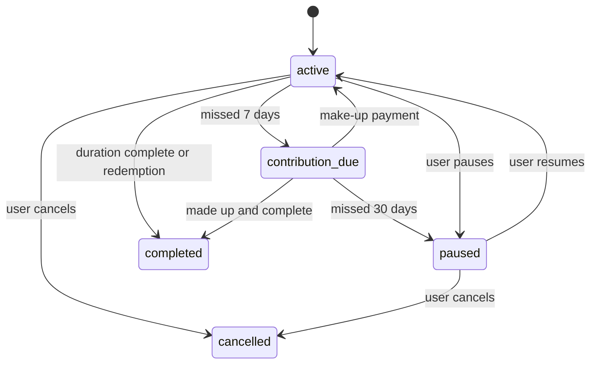
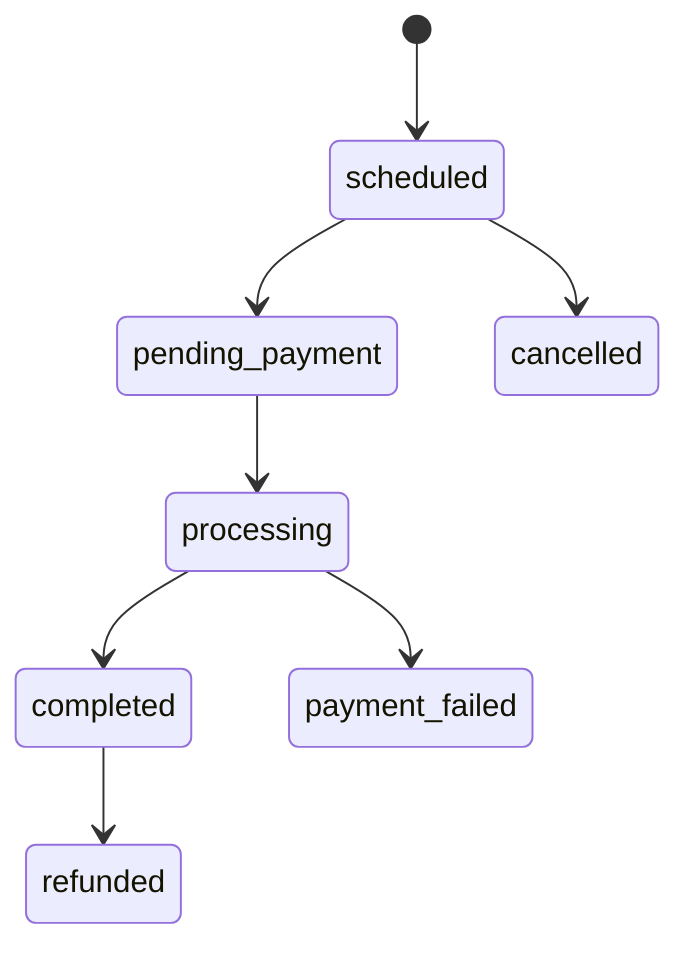
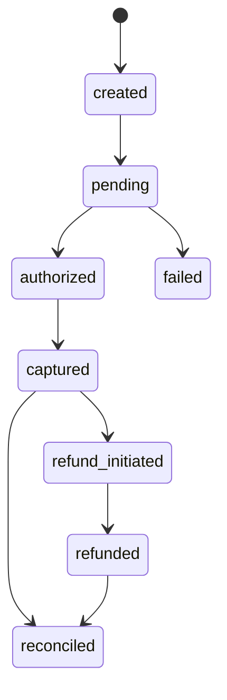
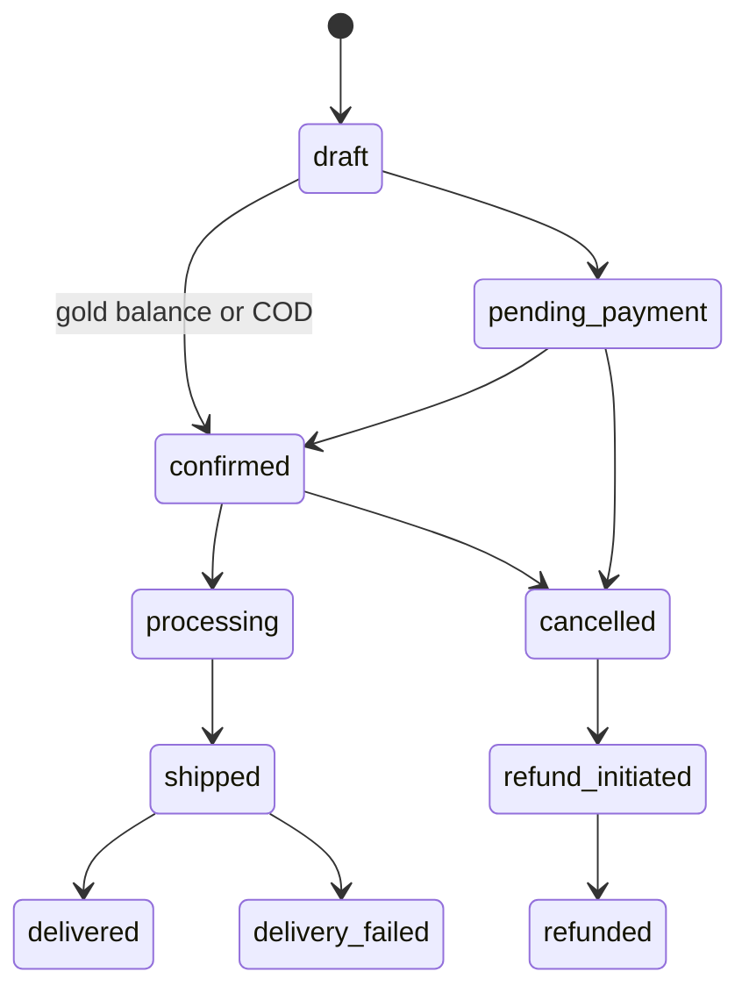
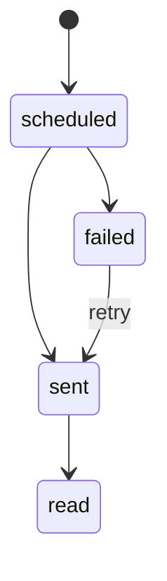
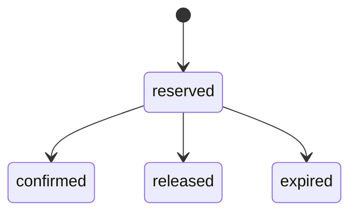

# 17 - Database Bible
## Moozhayil Gold & Diamonds - Database Authority

This document is the database authority. It supersedes `05-database.md` where conflicts exist.

No Prisma schema is generated here. This is a deterministic database contract for implementation.

---

## 1. Database Principles

### 1.1 Engine

Database: PostgreSQL 15 on AWS RDS.

Why: Moozhayil requires relational consistency, financial transactions, JSON snapshots, partitioning, indexes, constraints, and auditability.

### 1.2 Naming Conventions

- Tables: `snake_case`, plural nouns where natural.
- Columns: `snake_case`.
- Primary key: `id`.
- Foreign keys: `{singular_table}_id`.
- Timestamps: `created_at`, `updated_at`.
- Soft delete: `deleted_at`.
- Enum values: lowercase snake_case strings.
- Indexes: `idx_{table}_{columns}`.
- Unique constraints: `uq_{table}_{columns}`.
- Foreign keys: `fk_{table}_{column}_{referenced_table}`.

### 1.3 UUID Strategy

All primary keys are UUID v4 generated by the application or database.

Why: UUIDs are safe across distributed services, queues, imports, and future service extraction.

### 1.4 Time Zone Strategy

All timestamps are stored as `TIMESTAMPTZ` in UTC.

Date-only business fields use `DATE`.

Display uses user locale and IST where business context requires it.

### 1.5 Money Representation

All money is `INTEGER` paise.

Examples:
- ₹1 = `100`
- ₹2,360 = `236000`
- ₹84,966 = `8496600`

No floating-point money is allowed.

### 1.6 Gold Representation

Gold weight is `DECIMAL(10,4)` grams.

Display is floored to 1 decimal place.

### 1.7 Audit Strategy

All tables have `created_at` and `updated_at` unless explicitly marked append-only immutable.

Critical financial, KYC, admin, product, order, and rate changes write `audit_logs`.

Append-only tables do not update business fields after posting.

### 1.8 Soft Delete Policy

Soft delete is used for user-facing or referenced entities where historical links must survive:
- Users.
- Addresses.
- Products.
- Dream Vault items.
- Payment methods.
- Admin users.
- CMS banners.

Append-only financial tables are never soft-deleted.

### 1.9 Partition Strategy

Partition by month for append-heavy tables once production volume justifies it, and design migrations to allow partitioning from day one:
- `gold_ledger_entries`
- `payment_transactions`
- `webhook_events`
- `notifications`
- `product_views`
- `audit_logs`
- `job_runs`
- `outbox_events`

### 1.10 Security

Encrypted-at-rest fields:
- Aadhaar.
- PAN.
- KYC provider payload extracts.
- Sensitive webhook payloads where required.

Never store raw card data.

---

## 2. Canonical Enums

### User and KYC

`kyc_status`: `not_started`, `in_progress`, `in_review`, `basic_verified`, `enhanced_verified`, `rejected`

`intent_type`: `wedding`, `investment`, `festival`, `gift`, `family`, `other`

### Catalog

`purity`: `14k`, `18k`, `22k`, `24k`

`product_image_type`: `white_background`, `on_model`, `detail`, `lifestyle`

### Goals and Contributions

`goal_type`: `wedding`, `investment`, `festival`, `gift`, `family`, `other`

`goal_status`: `active`, `contribution_due`, `paused`, `completed`, `cancelled`

`contribution_status`: `scheduled`, `pending_payment`, `processing`, `completed`, `payment_failed`, `cancelled`, `refunded`

`contribution_type`: `autopay`, `manual`, `bonus`, `adjustment`

### Ledger

`ledger_entry_type`: `contribution_credit`, `bonus_credit`, `redemption_debit`, `refund_credit`, `manual_adjustment_credit`, `manual_adjustment_debit`

`ledger_status`: `pending`, `posted`, `reversed`

### Payments and Orders

`payment_method_type`: `upi`, `card`, `netbanking`

`payment_transaction_status`: `created`, `pending`, `authorized`, `captured`, `failed`, `refund_initiated`, `refunded`, `reconciled`

`payment_transaction_type`: `goal_contribution`, `order_payment`, `refund`, `mandate_setup`

`payment_provider`: `razorpay`

`order_status`: `draft`, `pending_payment`, `confirmed`, `processing`, `shipped`, `delivered`, `delivery_failed`, `cancelled`, `refund_initiated`, `refunded`

`order_payment_method`: `gold_balance`, `upi`, `card`, `netbanking`, `cod`

`inventory_reservation_status`: `reserved`, `confirmed`, `released`, `expired`

### Notifications and Aura

`notification_type`: `contribution_due`, `contribution_success`, `contribution_failed`, `milestone_reached`, `goal_completed`, `order_confirmed`, `order_shipped`, `order_delivered`, `kyc_verified`, `kyc_rejected`, `gold_rate_alert`, `aura_suggestion`, `product_back_in_stock`, `refund_initiated`, `refund_completed`

`aura_flow_type`: `goal_planning`, `product_discovery`, `gold_insights`, `chat`

`aura_role`: `aura`, `user`

### Admin and Ops

`admin_role`: `super_admin`, `catalog_manager`, `kyc_reviewer`, `order_manager`, `finance_manager`, `support_agent`, `auditor`

`outbox_status`: `pending`, `processing`, `processed`, `failed`, `dead_letter`

`webhook_status`: `received`, `processing`, `processed`, `ignored_duplicate`, `failed`

---

## 3. Tables

Each table definition includes purpose, columns, indexes, constraints, relationships, audit, soft delete, retention, partition strategy, security, and expected growth.

### 3.1 `users`

Purpose: Customer identity and profile root.

Columns:
- `id UUID PK NOT NULL`
- `phone VARCHAR(15) UNIQUE NOT NULL`
- `name VARCHAR(100) NULL`
- `email VARCHAR(255) UNIQUE NULL`
- `kyc_status kyc_status NOT NULL DEFAULT 'not_started'`
- `kyc_verified_at TIMESTAMPTZ NULL`
- `member_since DATE NOT NULL DEFAULT CURRENT_DATE`
- `city VARCHAR(100) NULL`
- `last_active_at TIMESTAMPTZ NULL`
- `deleted_at TIMESTAMPTZ NULL`
- `created_at TIMESTAMPTZ NOT NULL`
- `updated_at TIMESTAMPTZ NOT NULL`

Indexes:
- Unique `phone`
- Unique `email` where `email IS NOT NULL`
- `kyc_status`
- `last_active_at`

Relationships:
- One user has many sessions, devices, intents, goals, addresses, vault items, orders, notifications, ledger entries.

Audit: Profile and KYC status changes audit logged.

Soft delete: Yes, via `deleted_at`.

Retention: Retain as required by legal and transactional obligations.

Partition: None.

Security: Phone and email are PII. Do not log raw values.

Expected growth: Millions of rows.

### 3.2 `auth_sessions`

Purpose: Refresh-token-backed login sessions.

Columns:
- `id UUID PK`
- `user_id UUID FK users.id NOT NULL`
- `refresh_token_hash VARCHAR(255) NOT NULL`
- `device_id UUID FK user_devices.id NULL`
- `expires_at TIMESTAMPTZ NOT NULL`
- `revoked_at TIMESTAMPTZ NULL`
- `last_used_at TIMESTAMPTZ NULL`
- `created_at TIMESTAMPTZ NOT NULL`
- `updated_at TIMESTAMPTZ NOT NULL`

Indexes:
- `user_id`
- `device_id`
- `refresh_token_hash`
- `expires_at`

Unique constraints:
- `refresh_token_hash`

Audit: Logout and revocation audit logged.

Soft delete: No.

Retention: Delete expired/revoked sessions after 90 days.

Partition: None.

Security: Store only token hash.

Expected growth: Multiple rows per active user.

### 3.3 `user_devices`

Purpose: Device install and push token registry.

Columns:
- `id UUID PK`
- `user_id UUID FK users.id NOT NULL`
- `platform VARCHAR(20) NOT NULL`
- `push_token VARCHAR(500) NOT NULL`
- `device_fingerprint VARCHAR(255) NULL`
- `app_version VARCHAR(50) NULL`
- `last_seen_at TIMESTAMPTZ NULL`
- `disabled_at TIMESTAMPTZ NULL`
- `created_at TIMESTAMPTZ NOT NULL`
- `updated_at TIMESTAMPTZ NOT NULL`

Indexes:
- `user_id`
- `push_token`
- `last_seen_at`

Unique constraints:
- `push_token`

Audit: Device registration is not audit logged unless fraud investigation requires it.

Soft delete: Disabled via `disabled_at`.

Retention: Remove disabled devices after 180 days unless tied to fraud.

Partition: None.

Security: Push token is sensitive operational data.

Expected growth: 1-4 devices per active user.

### 3.4 `user_intents`

Purpose: Onboarding intent selections.

Columns:
- `id UUID PK`
- `user_id UUID FK users.id NOT NULL`
- `intent_type intent_type NOT NULL`
- `selected_at TIMESTAMPTZ NOT NULL`
- `is_active BOOLEAN NOT NULL DEFAULT true`
- `created_at TIMESTAMPTZ NOT NULL`
- `updated_at TIMESTAMPTZ NOT NULL`

Indexes:
- `user_id`
- `intent_type`

Unique constraints:
- `(user_id, intent_type)` where `is_active = true`

Audit: No separate audit required.

Soft delete: Deactivate with `is_active = false`.

Retention: Retain while user exists.

Partition: None.

Security: Preference data, not PII.

Expected growth: Up to 6 rows per user.

### 3.5 `kyc_documents`

Purpose: KYC verification record.

Columns:
- `id UUID PK`
- `user_id UUID FK users.id UNIQUE NOT NULL`
- `aadhaar_number_encrypted TEXT NULL`
- `aadhaar_verified BOOLEAN NOT NULL DEFAULT false`
- `pan_number_encrypted TEXT NULL`
- `pan_verified BOOLEAN NOT NULL DEFAULT false`
- `selfie_s3_key VARCHAR(1000) NULL`
- `selfie_verified BOOLEAN NOT NULL DEFAULT false`
- `name_on_aadhaar_encrypted TEXT NULL`
- `name_on_pan_encrypted TEXT NULL`
- `submitted_at TIMESTAMPTZ NULL`
- `reviewed_at TIMESTAMPTZ NULL`
- `rejection_reason TEXT NULL`
- `reviewer_id UUID FK admin_users.id NULL`
- `created_at TIMESTAMPTZ NOT NULL`
- `updated_at TIMESTAMPTZ NOT NULL`

Indexes:
- `user_id`
- `submitted_at`
- `reviewed_at`
- `reviewer_id`

Audit: All status and reviewer changes audit logged.

Soft delete: No.

Retention: Legal retention policy.

Partition: None.

Security: Highest sensitivity. Encrypted fields. Never log raw values.

Expected growth: One row per KYC user.

### 3.6 `addresses`

Purpose: Customer delivery addresses.

Columns:
- `id UUID PK`
- `user_id UUID FK users.id NOT NULL`
- `label VARCHAR(50) NULL`
- `full_name VARCHAR(100) NOT NULL`
- `phone VARCHAR(15) NOT NULL`
- `line1 VARCHAR(255) NOT NULL`
- `line2 VARCHAR(255) NULL`
- `city VARCHAR(100) NOT NULL`
- `state VARCHAR(100) NOT NULL`
- `pincode VARCHAR(6) NOT NULL`
- `is_default BOOLEAN NOT NULL DEFAULT false`
- `deleted_at TIMESTAMPTZ NULL`
- `created_at TIMESTAMPTZ NOT NULL`
- `updated_at TIMESTAMPTZ NOT NULL`

Indexes:
- `user_id`
- `pincode`
- `(user_id, is_default)`

Audit: Address changes not audit logged unless used in order snapshot.

Soft delete: Yes.

Retention: Retain order snapshots independently.

Partition: None.

Security: PII. Redact from logs and analytics.

Expected growth: 1-5 rows per user.

### 3.7 `serviceable_pincodes`

Purpose: Delivery and pickup serviceability.

Columns:
- `id UUID PK`
- `pincode VARCHAR(6) UNIQUE NOT NULL`
- `city VARCHAR(100) NOT NULL`
- `state VARCHAR(100) NOT NULL`
- `serviceable BOOLEAN NOT NULL`
- `estimated_delivery_days INTEGER NULL`
- `pickup_available BOOLEAN NOT NULL DEFAULT true`
- `created_at TIMESTAMPTZ NOT NULL`
- `updated_at TIMESTAMPTZ NOT NULL`

Indexes:
- Unique `pincode`
- `serviceable`

Audit: Admin changes audit logged.

Soft delete: No.

Retention: Indefinite.

Partition: None.

Security: Public operational data.

Expected growth: Tens of thousands.

### 3.8 `payment_methods`

Purpose: Tokenized saved payment methods.

Columns:
- `id UUID PK`
- `user_id UUID FK users.id NOT NULL`
- `type payment_method_type NOT NULL`
- `display_label VARCHAR(100) NOT NULL`
- `provider payment_provider NOT NULL DEFAULT 'razorpay'`
- `provider_token VARCHAR(500) NOT NULL`
- `is_default BOOLEAN NOT NULL DEFAULT false`
- `is_autopay_enabled BOOLEAN NOT NULL DEFAULT false`
- `deleted_at TIMESTAMPTZ NULL`
- `created_at TIMESTAMPTZ NOT NULL`
- `updated_at TIMESTAMPTZ NOT NULL`

Indexes:
- `user_id`
- `(user_id, is_default)`
- `(user_id, is_autopay_enabled)`

Audit: Payment method add/delete audit logged.

Soft delete: Yes.

Retention: Retain token metadata as required for active mandates.

Partition: None.

Security: Never store raw card data.

Expected growth: 1-3 rows per paying user.

### 3.9 `payment_mandates`

Purpose: Autopay mandate state.

Columns:
- `id UUID PK`
- `user_id UUID FK users.id NOT NULL`
- `payment_method_id UUID FK payment_methods.id NOT NULL`
- `provider payment_provider NOT NULL DEFAULT 'razorpay'`
- `provider_mandate_id VARCHAR(255) UNIQUE NOT NULL`
- `status VARCHAR(50) NOT NULL`
- `max_amount_paise INTEGER NOT NULL`
- `started_at TIMESTAMPTZ NULL`
- `ended_at TIMESTAMPTZ NULL`
- `created_at TIMESTAMPTZ NOT NULL`
- `updated_at TIMESTAMPTZ NOT NULL`

Indexes:
- `user_id`
- `payment_method_id`
- `status`
- Unique `provider_mandate_id`

Audit: Status changes audit logged.

Soft delete: No.

Retention: Legal/payment retention policy.

Partition: None.

Security: Provider token only.

Expected growth: Up to one active mandate per active goal/payment method.

### 3.10 `gold_rate_history`

Purpose: Gold rates by purity and time.

Columns:
- `id UUID PK`
- `purity purity NOT NULL`
- `rate_per_gram_paise INTEGER NOT NULL`
- `effective_from TIMESTAMPTZ NOT NULL`
- `effective_to TIMESTAMPTZ NULL`
- `source VARCHAR(100) NOT NULL`
- `created_by_admin_id UUID FK admin_users.id NULL`
- `created_at TIMESTAMPTZ NOT NULL`
- `updated_at TIMESTAMPTZ NOT NULL`

Indexes:
- `(purity, effective_from DESC)`
- `(purity, effective_to)`

Unique constraints:
- Only one active row per purity where `effective_to IS NULL`

Audit: Every insert and override audit logged.

Soft delete: No.

Retention: Indefinite.

Partition: Optional by year after long-term growth.

Security: Public price data, admin changes sensitive.

Expected growth: Low.

### 3.11 `products`

Purpose: Jewellery catalog items.

Columns:
- `id UUID PK`
- `sku VARCHAR(50) UNIQUE NOT NULL`
- `name VARCHAR(255) NOT NULL`
- `description TEXT NULL`
- `category_id UUID FK categories.id NOT NULL`
- `collection_id UUID FK collections.id NULL`
- `purity purity NOT NULL`
- `hallmark_number VARCHAR(50) NULL`
- `weight_grams DECIMAL(10,4) NOT NULL`
- `making_charge_pct DECIMAL(5,2) NOT NULL`
- `wastage_pct DECIMAL(5,2) NOT NULL DEFAULT 0`
- `has_stones BOOLEAN NOT NULL DEFAULT false`
- `stone_value_paise INTEGER NOT NULL DEFAULT 0`
- `gst_pct DECIMAL(5,2) NOT NULL DEFAULT 3.00`
- `stock_quantity INTEGER NOT NULL DEFAULT 0`
- `is_published BOOLEAN NOT NULL DEFAULT false`
- `is_featured BOOLEAN NOT NULL DEFAULT false`
- `has_ar BOOLEAN NOT NULL DEFAULT false`
- `ar_model_url VARCHAR(1000) NULL`
- `sort_order INTEGER NOT NULL DEFAULT 0`
- `deleted_at TIMESTAMPTZ NULL`
- `created_at TIMESTAMPTZ NOT NULL`
- `updated_at TIMESTAMPTZ NOT NULL`

Indexes:
- `sku`
- `category_id` where published and not deleted
- `collection_id` where published and not deleted
- `purity` where published
- `is_featured` where published
- Full-text index on name and description

Audit: Catalog edits audit logged.

Soft delete: Yes.

Retention: Indefinite for order history.

Partition: None.

Security: Public except unpublished fields.

Expected growth: Thousands to hundreds of thousands.

### 3.12 `product_images`

Purpose: Product image metadata.

Columns:
- `id UUID PK`
- `product_id UUID FK products.id NOT NULL`
- `s3_key VARCHAR(1000) NOT NULL`
- `cdn_url VARCHAR(1000) NOT NULL`
- `type product_image_type NOT NULL`
- `sort_order INTEGER NOT NULL DEFAULT 0`
- `is_primary BOOLEAN NOT NULL DEFAULT false`
- `created_at TIMESTAMPTZ NOT NULL`
- `updated_at TIMESTAMPTZ NOT NULL`

Indexes:
- `product_id`
- `(product_id, sort_order)`

Unique constraints:
- One primary image per product.

Audit: Image changes audit logged.

Soft delete: No; delete by product lifecycle or admin replacement with audit.

Retention: Retain active media; lifecycle cleanup unused derivatives.

Partition: None.

Security: Public via CloudFront only.

Expected growth: 4-12 rows per product.

### 3.13 `categories`

Purpose: Product category tree.

Columns:
- `id UUID PK`
- `name VARCHAR(100) NOT NULL`
- `slug VARCHAR(100) UNIQUE NOT NULL`
- `parent_id UUID FK categories.id NULL`
- `icon_url VARCHAR(1000) NULL`
- `image_url VARCHAR(1000) NULL`
- `sort_order INTEGER NOT NULL DEFAULT 0`
- `is_active BOOLEAN NOT NULL DEFAULT true`
- `created_at TIMESTAMPTZ NOT NULL`
- `updated_at TIMESTAMPTZ NOT NULL`

Indexes: `slug`, `parent_id`, `is_active`, `sort_order`

Audit: Admin changes audit logged.

Soft delete: No; deactivate.

Retention: Indefinite.

Partition: None.

Security: Public.

Expected growth: Low.

### 3.14 `collections`

Purpose: Editorial product collections.

Columns:
- `id UUID PK`
- `name VARCHAR(255) NOT NULL`
- `slug VARCHAR(255) UNIQUE NOT NULL`
- `description TEXT NULL`
- `cover_image_url VARCHAR(1000) NULL`
- `is_active BOOLEAN NOT NULL DEFAULT true`
- `is_featured BOOLEAN NOT NULL DEFAULT false`
- `valid_from DATE NULL`
- `valid_to DATE NULL`
- `sort_order INTEGER NOT NULL DEFAULT 0`
- `created_at TIMESTAMPTZ NOT NULL`
- `updated_at TIMESTAMPTZ NOT NULL`

Indexes: `slug`, `is_active`, `is_featured`, `valid_from`, `valid_to`

Audit: Admin changes audit logged.

Soft delete: No; deactivate.

Retention: Indefinite.

Partition: None.

Security: Public.

Expected growth: Low to medium.

### 3.15 `occasions`

Purpose: Occasion-based discovery taxonomy.

Columns:
- `id UUID PK`
- `name VARCHAR(100) NOT NULL`
- `slug VARCHAR(100) UNIQUE NOT NULL`
- `icon_url VARCHAR(1000) NULL`
- `bg_image_url VARCHAR(1000) NULL`
- `is_active BOOLEAN NOT NULL DEFAULT true`
- `sort_order INTEGER NOT NULL DEFAULT 0`
- `created_at TIMESTAMPTZ NOT NULL`
- `updated_at TIMESTAMPTZ NOT NULL`

Indexes: `slug`, `is_active`, `sort_order`

Audit: Admin changes audit logged.

Soft delete: No; deactivate.

Retention: Indefinite.

Partition: None.

Security: Public.

Expected growth: Low.

### 3.16 `product_occasion_tags`

Purpose: Many-to-many product occasion mapping.

Columns:
- `product_id UUID FK products.id NOT NULL`
- `occasion_id UUID FK occasions.id NOT NULL`
- `created_at TIMESTAMPTZ NOT NULL`

Primary key: `(product_id, occasion_id)`

Indexes: `occasion_id`, `product_id`

Audit: Product tag changes audit logged through product audit event.

Soft delete: No.

Retention: Active mapping only.

Partition: None.

Security: Public.

Expected growth: Several rows per product.

### 3.17 `dream_vault_items`

Purpose: Customer saved dream pieces.

Columns:
- `id UUID PK`
- `user_id UUID FK users.id NOT NULL`
- `product_id UUID FK products.id NOT NULL`
- `goal_id UUID FK goals.id NULL`
- `added_at TIMESTAMPTZ NOT NULL`
- `removed_at TIMESTAMPTZ NULL`
- `created_at TIMESTAMPTZ NOT NULL`
- `updated_at TIMESTAMPTZ NOT NULL`

Indexes:
- `user_id` where `removed_at IS NULL`
- `product_id`
- `goal_id`

Unique constraints:
- `(user_id, product_id)` where `removed_at IS NULL`

Audit: No audit unless support investigation.

Soft delete: `removed_at`.

Retention: Retain removed records for analytics unless user deletion policy requires removal.

Partition: Optional by `added_at` at large scale.

Security: User preference data.

Expected growth: 0-100 rows per active user.

### 3.18 `goals`

Purpose: Customer gold goal.

Columns:
- `id UUID PK`
- `user_id UUID FK users.id NOT NULL`
- `name VARCHAR(255) NOT NULL`
- `goal_type goal_type NOT NULL`
- `status goal_status NOT NULL DEFAULT 'active'`
- `target_product_id UUID FK products.id NULL`
- `target_amount_paise INTEGER NULL`
- `target_grams DECIMAL(10,4) NULL`
- `monthly_amount_paise INTEGER NOT NULL`
- `duration_months INTEGER NOT NULL`
- `start_date DATE NOT NULL`
- `next_contribution_date DATE NOT NULL`
- `completed_at TIMESTAMPTZ NULL`
- `paused_at TIMESTAMPTZ NULL`
- `cancelled_at TIMESTAMPTZ NULL`
- `bonus_eligible BOOLEAN NOT NULL DEFAULT true`
- `aura_created BOOLEAN NOT NULL DEFAULT false`
- `deleted_at TIMESTAMPTZ NULL`
- `created_at TIMESTAMPTZ NOT NULL`
- `updated_at TIMESTAMPTZ NOT NULL`

Indexes:
- `(user_id, status)` where `deleted_at IS NULL`
- `target_product_id`
- `next_contribution_date`

Audit: Status, amount, product attachment, cancellation audit logged.

Soft delete: Yes for UI removal, status remains authoritative.

Retention: Legal/financial retention.

Partition: None initially.

Security: Financial planning data.

Expected growth: Up to 5 active plus historical per user.

### 3.19 `contributions`

Purpose: Goal payment attempt and credited contribution record.

Columns:
- `id UUID PK`
- `goal_id UUID FK goals.id NOT NULL`
- `user_id UUID FK users.id NOT NULL`
- `payment_transaction_id UUID FK payment_transactions.id NULL`
- `amount_paise INTEGER NOT NULL`
- `gold_rate_per_gram_paise INTEGER NOT NULL`
- `grams_credited DECIMAL(10,4) NULL`
- `contribution_month DATE NOT NULL`
- `type contribution_type NOT NULL`
- `status contribution_status NOT NULL DEFAULT 'scheduled'`
- `payment_method_id UUID FK payment_methods.id NULL`
- `completed_at TIMESTAMPTZ NULL`
- `failed_at TIMESTAMPTZ NULL`
- `failure_reason TEXT NULL`
- `created_at TIMESTAMPTZ NOT NULL`
- `updated_at TIMESTAMPTZ NOT NULL`

Indexes:
- `(goal_id, contribution_month DESC)`
- `(user_id, status)`
- `payment_transaction_id`
- `contribution_month`

Unique constraints:
- `(goal_id, contribution_month, type)` for scheduled/autopay contributions.

Audit: Status transitions audit logged.

Soft delete: No.

Retention: Legal/financial retention.

Partition: By contribution month when volume requires.

Security: Financial data.

Expected growth: Monthly rows per active goal.

### 3.20 `gold_ledger_entries`

Purpose: Authoritative append-only gold balance ledger.

Columns:
- `id UUID PK`
- `user_id UUID FK users.id NOT NULL`
- `entry_type ledger_entry_type NOT NULL`
- `status ledger_status NOT NULL DEFAULT 'posted'`
- `grams_delta DECIMAL(10,4) NOT NULL`
- `amount_paise INTEGER NULL`
- `gold_rate_per_gram_paise INTEGER NOT NULL`
- `source_type VARCHAR(50) NOT NULL`
- `source_id UUID NOT NULL`
- `correlation_id UUID NOT NULL`
- `idempotency_key VARCHAR(100) NULL`
- `reversal_of_ledger_entry_id UUID FK gold_ledger_entries.id NULL`
- `posted_at TIMESTAMPTZ NOT NULL`
- `created_at TIMESTAMPTZ NOT NULL`

Indexes:
- `(user_id, posted_at DESC)`
- `(user_id, status)`
- `source_type, source_id`
- `correlation_id`
- `idempotency_key`

Unique constraints:
- `idempotency_key` where not null.

Audit: It is the audit record. Manual adjustments also write `audit_logs`.

Soft delete: Never.

Retention: Indefinite/legal.

Partition: Monthly by `posted_at`.

Security: Highest financial integrity.

Expected growth: High.

### 3.21 `gold_balance_snapshots`

Purpose: Cached balance snapshot for fast reads.

Columns:
- `id UUID PK`
- `user_id UUID FK users.id NOT NULL`
- `total_grams DECIMAL(10,4) NOT NULL`
- `total_value_paise INTEGER NOT NULL`
- `gold_rate_used_paise INTEGER NOT NULL`
- `snapshot_at TIMESTAMPTZ NOT NULL`
- `reason VARCHAR(50) NOT NULL`
- `created_at TIMESTAMPTZ NOT NULL`

Indexes:
- `(user_id, snapshot_at DESC)`

Audit: Recomputable from ledger, no separate audit.

Soft delete: No.

Retention: Keep last 90 days plus latest snapshot indefinitely.

Partition: Optional by `snapshot_at`.

Security: Financial summary.

Expected growth: Medium to high.

### 3.22 `inventory_reservations`

Purpose: Hold stock during checkout and pending payment.

Columns:
- `id UUID PK`
- `product_id UUID FK products.id NOT NULL`
- `user_id UUID FK users.id NOT NULL`
- `order_id UUID FK orders.id NULL`
- `quantity INTEGER NOT NULL`
- `status inventory_reservation_status NOT NULL`
- `reserved_at TIMESTAMPTZ NOT NULL`
- `expires_at TIMESTAMPTZ NOT NULL`
- `confirmed_at TIMESTAMPTZ NULL`
- `released_at TIMESTAMPTZ NULL`
- `created_at TIMESTAMPTZ NOT NULL`
- `updated_at TIMESTAMPTZ NOT NULL`

Indexes:
- `(product_id, status)`
- `expires_at`
- `order_id`
- `user_id`

Audit: Status changes audit logged for order-linked reservations.

Soft delete: No.

Retention: Keep historical reservations for 1 year.

Partition: Optional by `reserved_at`.

Security: Operational.

Expected growth: Medium to high.

### 3.23 `orders`

Purpose: Customer purchase order.

Columns:
- `id UUID PK`
- `order_number VARCHAR(30) UNIQUE NOT NULL`
- `user_id UUID FK users.id NOT NULL`
- `status order_status NOT NULL`
- `total_paise INTEGER NOT NULL`
- `gold_value_paise INTEGER NOT NULL`
- `making_charges_paise INTEGER NOT NULL`
- `wastage_paise INTEGER NOT NULL DEFAULT 0`
- `stone_value_paise INTEGER NOT NULL DEFAULT 0`
- `gst_paise INTEGER NOT NULL`
- `delivery_address_id UUID FK addresses.id NULL`
- `delivery_address_snapshot JSONB NOT NULL`
- `payment_method order_payment_method NOT NULL`
- `gold_balance_used_grams DECIMAL(10,4) NOT NULL DEFAULT 0`
- `gold_rate_at_order_paise INTEGER NOT NULL`
- `payment_transaction_id UUID FK payment_transactions.id NULL`
- `notes TEXT NULL`
- `shipped_at TIMESTAMPTZ NULL`
- `delivered_at TIMESTAMPTZ NULL`
- `cancelled_at TIMESTAMPTZ NULL`
- `refunded_at TIMESTAMPTZ NULL`
- `cancellation_reason TEXT NULL`
- `created_at TIMESTAMPTZ NOT NULL`
- `updated_at TIMESTAMPTZ NOT NULL`

Indexes:
- `user_id, created_at DESC`
- `status`
- `order_number`
- `payment_transaction_id`

Audit: All status changes audit logged.

Soft delete: No.

Retention: Legal/financial retention.

Partition: By created month at scale.

Security: Financial and address snapshot data.

Expected growth: High.

### 3.24 `order_items`

Purpose: Immutable order line-item snapshot.

Columns:
- `id UUID PK`
- `order_id UUID FK orders.id NOT NULL`
- `product_id UUID FK products.id NOT NULL`
- `product_snapshot JSONB NOT NULL`
- `quantity INTEGER NOT NULL DEFAULT 1`
- `unit_price_paise INTEGER NOT NULL`
- `weight_grams DECIMAL(10,4) NOT NULL`
- `gold_rate_paise INTEGER NOT NULL`
- `created_at TIMESTAMPTZ NOT NULL`

Indexes:
- `order_id`
- `product_id`

Audit: Immutable snapshot.

Soft delete: No.

Retention: Legal/financial retention.

Partition: Follows orders if needed.

Security: Financial snapshot.

Expected growth: One or more rows per order.

### 3.25 `cart_items`

Purpose: Customer cart.

Columns:
- `id UUID PK`
- `user_id UUID FK users.id NOT NULL`
- `product_id UUID FK products.id NOT NULL`
- `quantity INTEGER NOT NULL DEFAULT 1`
- `added_at TIMESTAMPTZ NOT NULL`
- `created_at TIMESTAMPTZ NOT NULL`
- `updated_at TIMESTAMPTZ NOT NULL`

Indexes:
- `user_id`
- `product_id`

Unique constraints:
- `(user_id, product_id)`

Audit: No.

Soft delete: No. Delete row when removed.

Retention: Clear on order completion; stale carts may be pruned after 180 days.

Partition: None.

Security: Preference data.

Expected growth: Low to medium.

### 3.26 `payment_transactions`

Purpose: Payment attempts and provider state.

Columns:
- `id UUID PK`
- `user_id UUID FK users.id NOT NULL`
- `provider payment_provider NOT NULL`
- `provider_payment_id VARCHAR(255) NULL`
- `provider_order_id VARCHAR(255) NULL`
- `type payment_transaction_type NOT NULL`
- `status payment_transaction_status NOT NULL`
- `amount_paise INTEGER NOT NULL`
- `currency VARCHAR(3) NOT NULL DEFAULT 'INR'`
- `idempotency_key VARCHAR(100) NULL`
- `failure_code VARCHAR(100) NULL`
- `failure_message TEXT NULL`
- `created_at TIMESTAMPTZ NOT NULL`
- `updated_at TIMESTAMPTZ NOT NULL`

Indexes:
- `user_id`
- `status`
- `provider_payment_id`
- `provider_order_id`
- `idempotency_key`

Unique constraints:
- `provider_payment_id` where not null.
- `idempotency_key` where not null.

Audit: Status changes audit logged.

Soft delete: No.

Retention: Legal/payment retention.

Partition: Monthly by `created_at`.

Security: Provider IDs sensitive.

Expected growth: High.

### 3.27 `webhook_events`

Purpose: Durable raw provider webhook log.

Columns:
- `id UUID PK`
- `provider VARCHAR(50) NOT NULL`
- `provider_event_id VARCHAR(255) NOT NULL`
- `event_type VARCHAR(100) NOT NULL`
- `status webhook_status NOT NULL`
- `payload JSONB NOT NULL`
- `signature_valid BOOLEAN NOT NULL`
- `received_at TIMESTAMPTZ NOT NULL`
- `processed_at TIMESTAMPTZ NULL`
- `error_message TEXT NULL`
- `created_at TIMESTAMPTZ NOT NULL`
- `updated_at TIMESTAMPTZ NOT NULL`

Indexes:
- `(provider, provider_event_id)`
- `status`
- `received_at`

Unique constraints:
- `(provider, provider_event_id)`

Audit: Table itself is audit trail.

Soft delete: No.

Retention: Legal/provider retention.

Partition: Monthly by received date.

Security: Payload may contain sensitive provider data.

Expected growth: High.

### 3.28 `idempotency_keys`

Purpose: Idempotent request result tracking.

Columns:
- `id UUID PK`
- `user_id UUID FK users.id NULL`
- `key VARCHAR(100) NOT NULL`
- `scope VARCHAR(100) NOT NULL`
- `request_hash VARCHAR(255) NOT NULL`
- `response_snapshot JSONB NULL`
- `resource_type VARCHAR(50) NULL`
- `resource_id UUID NULL`
- `expires_at TIMESTAMPTZ NOT NULL`
- `created_at TIMESTAMPTZ NOT NULL`
- `updated_at TIMESTAMPTZ NOT NULL`

Indexes:
- `(scope, key)`
- `expires_at`

Unique constraints:
- `(scope, key)`

Audit: No.

Soft delete: No.

Retention: Delete after expiry.

Partition: Optional by created date.

Security: Do not store raw sensitive request data.

Expected growth: High transient.

### 3.29 `notifications`

Purpose: In-app notification and push tracking.

Columns:
- `id UUID PK`
- `user_id UUID FK users.id NOT NULL`
- `type notification_type NOT NULL`
- `title VARCHAR(255) NOT NULL`
- `body TEXT NOT NULL`
- `deep_link VARCHAR(500) NULL`
- `metadata JSONB NULL`
- `is_read BOOLEAN NOT NULL DEFAULT false`
- `is_sent BOOLEAN NOT NULL DEFAULT false`
- `sent_at TIMESTAMPTZ NULL`
- `read_at TIMESTAMPTZ NULL`
- `scheduled_for TIMESTAMPTZ NULL`
- `created_at TIMESTAMPTZ NOT NULL`
- `updated_at TIMESTAMPTZ NOT NULL`

Indexes:
- `(user_id, created_at DESC)`
- `(user_id, is_read)` where `is_read = false`
- `scheduled_for`

Audit: No.

Soft delete: No.

Retention: Keep 2 years or per policy.

Partition: Monthly by created date at scale.

Security: No PII in notification body.

Expected growth: High.

### 3.30 `user_milestones`

Purpose: Reached milestone tracking.

Columns:
- `id UUID PK`
- `user_id UUID FK users.id NOT NULL`
- `milestone_type VARCHAR(50) NOT NULL`
- `reached_at TIMESTAMPTZ NOT NULL`
- `celebrated_at TIMESTAMPTZ NULL`
- `goal_id UUID FK goals.id NULL`
- `created_at TIMESTAMPTZ NOT NULL`
- `updated_at TIMESTAMPTZ NOT NULL`

Indexes:
- `(user_id, celebrated_at)`
- `(user_id, milestone_type)`

Unique constraints:
- `(user_id, milestone_type)`

Audit: No.

Soft delete: No.

Retention: User lifetime.

Partition: None.

Security: Low sensitivity.

Expected growth: Low.

### 3.31 `aura_sessions`

Purpose: Aura session metadata.

Columns:
- `id UUID PK`
- `user_id UUID FK users.id NOT NULL`
- `flow_type aura_flow_type NOT NULL`
- `summary TEXT NULL`
- `started_at TIMESTAMPTZ NOT NULL`
- `ended_at TIMESTAMPTZ NULL`
- `expires_at TIMESTAMPTZ NOT NULL`
- `goal_created BOOLEAN NOT NULL DEFAULT false`
- `products_added_to_vault INTEGER NOT NULL DEFAULT 0`
- `goal_id_created UUID FK goals.id NULL`
- `created_at TIMESTAMPTZ NOT NULL`
- `updated_at TIMESTAMPTZ NOT NULL`

Indexes:
- `(user_id, started_at DESC)`
- `expires_at`

Audit: No.

Soft delete: No.

Retention: Summaries 1 year; raw messages per privacy policy.

Partition: Optional by started date.

Security: No raw PII.

Expected growth: Medium to high.

### 3.32 `aura_messages`

Purpose: Aura message turns.

Columns:
- `id UUID PK`
- `session_id UUID FK aura_sessions.id NOT NULL`
- `role aura_role NOT NULL`
- `content TEXT NOT NULL`
- `metadata JSONB NULL`
- `sequence INTEGER NOT NULL`
- `created_at TIMESTAMPTZ NOT NULL`

Indexes:
- `(session_id, sequence)`

Unique constraints:
- `(session_id, sequence)`

Audit: No.

Soft delete: No.

Retention: Privacy policy; summarize and prune raw content where possible.

Partition: Optional by created date.

Security: Raw chat text must not include KYC/payment secrets.

Expected growth: High if chat usage grows.

### 3.33 `product_views`

Purpose: Product view analytics and personalization.

Columns:
- `id UUID PK`
- `user_id UUID FK users.id NULL`
- `anonymous_id VARCHAR(100) NULL`
- `product_id UUID FK products.id NOT NULL`
- `source VARCHAR(50) NULL`
- `viewed_at TIMESTAMPTZ NOT NULL`
- `created_at TIMESTAMPTZ NOT NULL`

Indexes:
- `(user_id, viewed_at DESC)`
- `(product_id, viewed_at DESC)`
- `anonymous_id`

Audit: No.

Soft delete: No.

Retention: 90 days raw, then aggregate.

Partition: Monthly by viewed date.

Security: Behavioral data.

Expected growth: Very high.

### 3.34 `cms_banners`

Purpose: Dynamic banners and CMS placements.

Columns:
- `id UUID PK`
- `title VARCHAR(255) NOT NULL`
- `image_url VARCHAR(1000) NOT NULL`
- `cta_label VARCHAR(100) NULL`
- `cta_route VARCHAR(500) NULL`
- `placement VARCHAR(50) NOT NULL`
- `sort_order INTEGER NOT NULL DEFAULT 0`
- `valid_from TIMESTAMPTZ NULL`
- `valid_to TIMESTAMPTZ NULL`
- `is_active BOOLEAN NOT NULL DEFAULT true`
- `created_by_admin_id UUID FK admin_users.id NULL`
- `updated_by_admin_id UUID FK admin_users.id NULL`
- `deleted_at TIMESTAMPTZ NULL`
- `created_at TIMESTAMPTZ NOT NULL`
- `updated_at TIMESTAMPTZ NOT NULL`

Indexes:
- `(placement, is_active, sort_order)`
- `valid_from`
- `valid_to`

Audit: Admin changes audit logged.

Soft delete: Yes.

Retention: Indefinite.

Partition: None.

Security: Public content.

Expected growth: Low.

### 3.35 `referrals`

Purpose: Referral program state.

Columns:
- `id UUID PK`
- `referrer_user_id UUID FK users.id NOT NULL`
- `referred_user_id UUID FK users.id NULL`
- `referral_code VARCHAR(20) NOT NULL`
- `status VARCHAR(30) NOT NULL DEFAULT 'pending'`
- `registered_at TIMESTAMPTZ NULL`
- `rewarded_at TIMESTAMPTZ NULL`
- `reward_type VARCHAR(50) NULL`
- `reward_value_paise INTEGER NULL`
- `created_at TIMESTAMPTZ NOT NULL`
- `updated_at TIMESTAMPTZ NOT NULL`

Indexes:
- `referrer_user_id`
- `referred_user_id`
- `status`

Unique constraints:
- `referral_code`
- `referred_user_id` where not null.

Audit: Reward grants audit logged.

Soft delete: No.

Retention: Business retention.

Partition: None.

Security: Fraud-sensitive.

Expected growth: Medium.

### 3.36 `store_locations`

Purpose: Physical store directory.

Columns:
- `id UUID PK`
- `name VARCHAR(255) NOT NULL`
- `address TEXT NOT NULL`
- `city VARCHAR(100) NOT NULL`
- `state VARCHAR(100) NOT NULL`
- `pincode VARCHAR(6) NOT NULL`
- `phone VARCHAR(15) NOT NULL`
- `latitude DECIMAL(9,6) NOT NULL`
- `longitude DECIMAL(9,6) NOT NULL`
- `opening_hours JSONB NOT NULL`
- `is_active BOOLEAN NOT NULL DEFAULT true`
- `created_at TIMESTAMPTZ NOT NULL`
- `updated_at TIMESTAMPTZ NOT NULL`

Indexes:
- `city`
- `pincode`
- `is_active`
- `(latitude, longitude)`

Audit: Admin changes audit logged.

Soft delete: Deactivate.

Retention: Indefinite.

Partition: None.

Security: Public.

Expected growth: Low.

### 3.37 `admin_users`

Purpose: Internal admin identities.

Columns:
- `id UUID PK`
- `email VARCHAR(255) UNIQUE NOT NULL`
- `name VARCHAR(100) NOT NULL`
- `role admin_role NOT NULL`
- `mfa_enabled BOOLEAN NOT NULL DEFAULT false`
- `disabled_at TIMESTAMPTZ NULL`
- `last_login_at TIMESTAMPTZ NULL`
- `created_at TIMESTAMPTZ NOT NULL`
- `updated_at TIMESTAMPTZ NOT NULL`

Indexes:
- `email`
- `role`

Audit: Login and role changes audit logged.

Soft delete: Disabled.

Retention: Indefinite for audit.

Partition: None.

Security: Highly sensitive.

Expected growth: Low.

### 3.38 `audit_logs`

Purpose: Immutable admin and sensitive action audit trail.

Columns:
- `id UUID PK`
- `actor_type VARCHAR(30) NOT NULL`
- `actor_id UUID NULL`
- `action VARCHAR(100) NOT NULL`
- `entity_type VARCHAR(100) NOT NULL`
- `entity_id UUID NULL`
- `before JSONB NULL`
- `after JSONB NULL`
- `reason TEXT NULL`
- `request_id UUID NULL`
- `ip_address INET NULL`
- `created_at TIMESTAMPTZ NOT NULL`

Indexes:
- `(entity_type, entity_id)`
- `(actor_type, actor_id)`
- `action`
- `created_at`

Audit: This is the audit table.

Soft delete: Never.

Retention: Legal/security retention.

Partition: Monthly by `created_at`.

Security: Sensitive operational data.

Expected growth: High.

### 3.39 `outbox_events`

Purpose: Transactional outbox for async side effects.

Columns:
- `id UUID PK`
- `event_type VARCHAR(100) NOT NULL`
- `aggregate_type VARCHAR(100) NOT NULL`
- `aggregate_id UUID NOT NULL`
- `payload JSONB NOT NULL`
- `status outbox_status NOT NULL DEFAULT 'pending'`
- `attempts INTEGER NOT NULL DEFAULT 0`
- `next_attempt_at TIMESTAMPTZ NULL`
- `processed_at TIMESTAMPTZ NULL`
- `error_message TEXT NULL`
- `created_at TIMESTAMPTZ NOT NULL`
- `updated_at TIMESTAMPTZ NOT NULL`

Indexes:
- `(status, next_attempt_at)`
- `(aggregate_type, aggregate_id)`
- `created_at`

Audit: Operational trace, not user audit.

Soft delete: No.

Retention: Processed events 90 days; failed/dead-letter until resolved.

Partition: Monthly by `created_at`.

Security: Payload must avoid raw PII unless necessary and encrypted.

Expected growth: Very high.

### 3.40 `job_runs`

Purpose: Background job execution history.

Columns:
- `id UUID PK`
- `queue_name VARCHAR(100) NOT NULL`
- `job_name VARCHAR(100) NOT NULL`
- `job_key VARCHAR(255) NULL`
- `status VARCHAR(50) NOT NULL`
- `attempts INTEGER NOT NULL DEFAULT 0`
- `started_at TIMESTAMPTZ NULL`
- `finished_at TIMESTAMPTZ NULL`
- `error_message TEXT NULL`
- `created_at TIMESTAMPTZ NOT NULL`
- `updated_at TIMESTAMPTZ NOT NULL`

Indexes:
- `(queue_name, status)`
- `job_key`
- `created_at`

Audit: Operational.

Soft delete: No.

Retention: 90 days.

Partition: Monthly by created date.

Security: No PII in error messages.

Expected growth: High.

---

## 4. ER Diagram

```mermaid
erDiagram
  users ||--o{ auth_sessions : has
  users ||--o{ user_devices : has
  users ||--o{ user_intents : selects
  users ||--|| kyc_documents : verifies
  users ||--o{ addresses : owns
  users ||--o{ payment_methods : owns
  users ||--o{ goals : creates
  users ||--o{ dream_vault_items : saves
  users ||--o{ orders : places
  users ||--o{ gold_ledger_entries : owns
  users ||--o{ notifications : receives
  users ||--o{ aura_sessions : starts
  users ||--o{ product_views : views

  products ||--o{ product_images : has
  products ||--o{ product_occasion_tags : tagged
  occasions ||--o{ product_occasion_tags : maps
  categories ||--o{ products : contains
  collections ||--o{ products : groups
  products ||--o{ dream_vault_items : saved
  products ||--o{ order_items : purchased
  products ||--o{ inventory_reservations : reserved

  goals ||--o{ contributions : has
  goals ||--o{ dream_vault_items : attached
  payment_transactions ||--o{ contributions : funds
  payment_transactions ||--o{ orders : pays
  orders ||--o{ order_items : contains
  orders ||--o{ inventory_reservations : consumes
  aura_sessions ||--o{ aura_messages : contains
  admin_users ||--o{ audit_logs : writes
```



---

## 5. State Transition Diagrams

### Goal Lifecycle



### Contribution Lifecycle



### Payment Lifecycle



### Order Lifecycle



### Notification Lifecycle



### Inventory Lifecycle



---

## 6. Ledger Design

The ledger is the only authoritative gold balance source.

Balance query:

```sql
SUM(grams_delta)
WHERE user_id = :user_id
AND status = 'posted'
```

Rules:
- Append-only.
- No updates to posted business fields.
- No deletes.
- Reversals are new entries.
- Every ledger entry has source and correlation IDs.
- Manual adjustments require maker-checker admin approval.

---

## 7. Migration Strategy

Rules:
- Use expand-contract migrations.
- No destructive production migration in the same release that removes code usage.
- Backfill in batches.
- All migrations run in staging first.
- Production rollback must not require rolling back applied migrations.
- Large table migrations require lock analysis.

---

## 8. Database Readiness Checklist

- All money fields are integer paise.
- All gold fields are `DECIMAL(10,4)`.
- All customer-facing history tables preserve snapshots.
- Ledger is append-only.
- Webhook events are idempotent.
- Reservations prevent oversell.
- RDS connection pooling is enabled.
- Partition candidates have retention plans.
- PII fields are encrypted or redacted.
